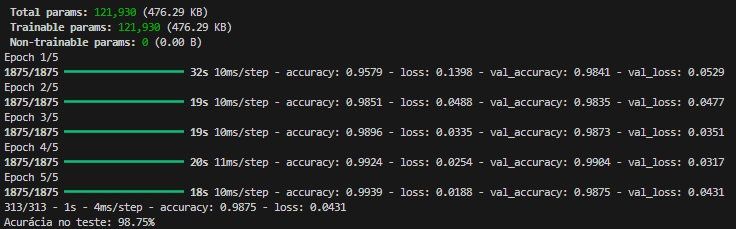
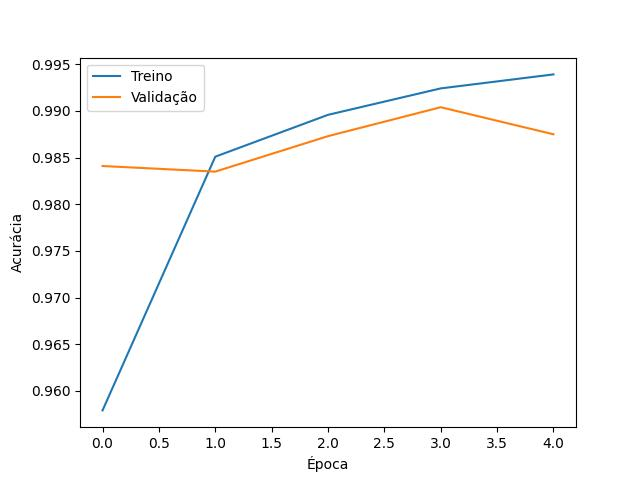
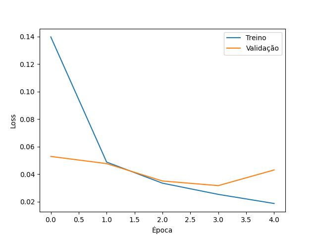
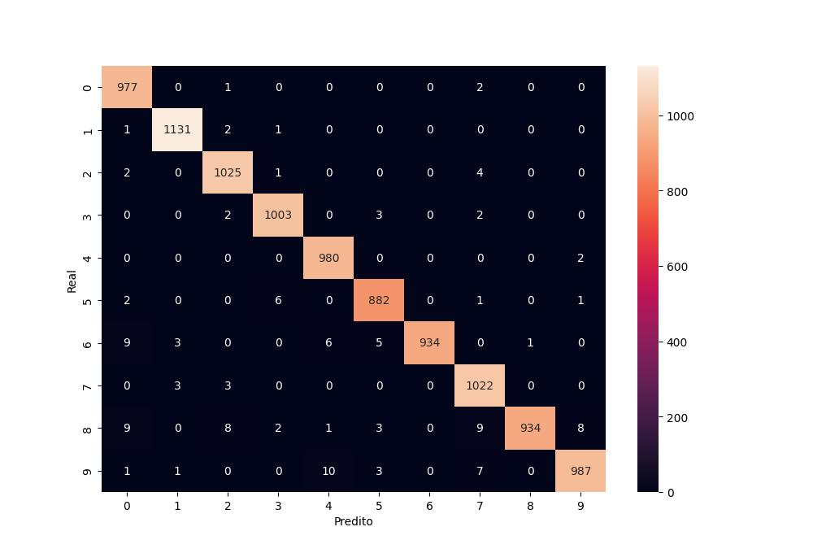

****
## 📝 Relatório

👤 Identificação: **Lucas Vinicius Santos Leonel**

### 1️⃣ Resumo da Arquitetura do Modelo

`train_model.py`.

1. Fluxo de Tratamento de Dados

  - `Carregamento do Dados:` O dataset MINIST é devidido em 60.000 imagens para realização do treinamento e 10.000 imagens para teste. 
  
  - `Normalização:` Os valores dos pixels variam de 0(Preto absoluto) a 255(branco absoluto). Para realização do treinamento, os valores são normalizados para o intervalo 0 e 1. 
  
  - `Reshaping:`As imagens são redimensionadas para o formato (28, 28, 1), onde 28 X 28 é a resolução em pixels e o valor 1 representa o canal de cor em escala de cinza. 

2. Arquitetura da CNN 

| Camada | Tipo | Função |
| :---: | :---: | :---: |
| `Conv2D(32)` | Convolucional | Aplica 32 filtros diferentes para detectar caracteristicas simples (Como bordas, contornos e texturas) |
| `Maxpooling2D` | Subamostragem | Usada para compactar a imagem. Verifica um quadrado 2 X 2 de pixels e mantém o maior valor |
| `Conv2D(64)` | Convolucional | Aplica 64 filtros para detectar combinações mais complexas (Ccmo curvas, formas geométricas e padrões de textura) |
| `Maxpooling2D` | Subamostragem | Segunda redução para aumentar a eficiência computacional e controlar o overfitting |
| `Flatten` | Planificação | Transforma a matriz 2D em um vetor de 1D para entrada nas camadas maiores |
| `Dense (64)` | Totalmente Conectada | Camada de neurônio onde cada entrada se conecta a cada saída. Utiliza a ativação reLU para introduzir a não-linearidade e para aprender padrões complexos |
| `Dense (10)` | Saída | Camada final com ativação Softmax, que gera as probabilidades de cada imagem pertencer a cada uma das 10 classes (digitos de 0 a 9) |

3. Estratégia de Aprendizado 
  
  - `Otimizador adam:` É utilizado para ajustar a taxa de aprendizado dinamicamente.
  
  - `Loss (Perda):` Aplicado para classificação de multiplas classes onde os rótulos de cada classe é um número inteiro.  
  
  - `Métricas (Acurácia):` Métrica utilizada para acompanhar o percentual de acerto durante a realização do treinamento. 

4. Treinamento:

  - `Cinco Épocas:` O modelo utilizado para treinamento é divido em 5 épocas. Em cada época, o algoritmo processa o conjunto de dados de treinamento e valida o desempenho com conjunto de teste. A performance final é medida pela acurácia alcançada ao fim do ciclo. 

  - `Final:` No final do processo, o modelo treinado é exportado com o nome `model.h5`, permitindo a implementação dos etapas seguintes. 

### 2️⃣ Bibliotecas e Tecnologias Utilizadas

- TensorFlow(v2.21.0) & Keras: Biblioteca utilizada para o desenvolvimento, treinamento e execução dos modelo da CNN. Adicionalmente, foi utilizado o keras (Uma interface da biblioteca TensorFlow) para a construção de componentes importantes da CNN.

- Numpy (v1.26.4): É Utilizada para operações de manipulação de arrays, incluindo normalização, reshape das imagens e conversão das predições em classes através do `argmax`. 

- Modulo Nativo (OS): é uma biblioteca nativa que segue a mesma versão do python
  
- Matplotlib (v3.7.1): Utilizada para a visualização gráfica do histórico de treinamento, gerando os gráficos de` acurácia` e `loss` por época.

- Scikit-learn (v1.8.0): Utilizada para a avaliação detalhada do modelo, através do `classification_report` e da `confusion_matrix`, permitindo analisar a performance por classe.

- Seaborn (v0.12.2): Utilizada em conjunto com o `Matplotlib` para a visualização da matriz de confusão.
 
- Linguagem Python (v3.11.2): base de desenvolvimento. 

- Ambiente de Desenvolvimento: VS Code (Visual Studio Code) 

### 3️⃣ Técnica de Otimização do Modelo

`optimize_model.py`.

1. Técnica Utilizada

  - `Post-Training Quantization:` A técnica de Quantização Pós-Treinamento no qual os valores decimais de alta precisão (Float32) são reduzidos para formatos menores, como o `int8` ou `floats`. Este processo reduz de forma considerável o tamanho do arquivo final e otimiza a forma como os sistemas embarcados processam cálculos, resultando em um ganho considerável na velocidade de inferência.  

2. Processo de Conversão: 

  - `Instanciação do Conversor:` Etapa em que o modelo treinado é carregado, preparando toda a estrutura da rede para a tradução do novo formato.  

  - `Aplicação da Otimização:` Utiliza a estratégia `DEFAULT` para busca o melhor equilíbrio entre perda mínima de acurácia e ganha máximo de desempenho, para que o modelo não perca a sua eficiência mesmo após a sua otimização. 

  - `Serialização:` O comando `converter.convert()` gera o grafo otimizado, que é escrito em um arquivo do tipo `.tflite`, pronto para ser utilizado em dispositivos. 

### 4️⃣ Resultados Obtidos

Apresentação de Todas as metricas de desempenho da implementado na CNN 

| Epoch | Acurácia (Treino) | Perda (Treino) | Acurácia (Teste) | Perda (Teste) |
| :---: | :---: | :---: | :---: | :---: |
| 1 | 95,79% | 0,1398 | 98,41% | 0,0529 |
| 2 | 98,51% | 0,0488 | 98,35% | 0,0477 |
| 3 | 98,96% | 0,0335 | 98,73% | 0,0351 |
| 4 | 99,24% | 0,0254 | 99,04% | 0,0317 |
| 5 | **99,39%** | **0,0188** | **98,75%** | **0,0431** |

**Acurácia Final:** O modelo atingiu **98.75%** de precisão nos dados de teste.  

**Gráfico de Acurácia por Epoca**

A partir da época 1 a linha de treino ultrapassa a linha de validação e o gap vai aumentando para as próximas épocas. A partir da época 4, a linha de validação cai, enquando a linha de treino permanece em ascenção. Isso indica que o modelo está se ajustando de mais aos dados de treino (Possível overfitting). Uma solução seria reduzir o número de época para 3, que foi onde a validação atingiu o seu pico máximo. Porém, o algoritmo ficou com 5 epocas pois está em um limite aceitavel e com validação de 98.8%. 

**Loss por época**

O gráfico com informações de loss por época. 
Como mostrado pelo gráfico, o modelo de treino cai de forma considerável. 
O modelo de validação mostra uma redução até a época 3, mas seguindo de um aumento na época 4. Por conta disso, temos que o treino continua caindo, enquanto a validação começa a subir (Sinal de Overfitting). O modelo está começando a decorar o treino. 

**Matriz de confusão**

A diagonal principal está bem definida e os valores fora dela são muito pequenos. (O modelo acerta muito e apresenta alguns erros) 

O digito 5 foi o número com menor valor na diagonal. Ou seja, o modelo teve mais dificuldade para acertá-lo. 

Os erros também aparecem entre os digitos mais paracidos como 6 <-> 0 e 8 <-> 9 e o 9 <-> 4.

O modelo apresenta confução em digitos que tem traços parecidos, o que é de se esperar. 

**Otimização do Modelo**

O modelo apresentou um redução considerável, onde:

- model.h5 -> 1.43 MB **Modelo de Treino**

- mode.tlite -> 128 KB **modelo otimizado**

### 5️⃣ Comentários Adicionais 

- Dificuldades encontradas, aprendizados e próximos passos: 

O desafio foi especialmente relevante por se alinhar a uma das áreas de maior interesse na minha trajetória. Compreender o processo completo de implementação de uma CNN e as nuances do problema exigiu dedicação, mas as ideias foram se acertando progressivamente e o projeto evoluiu. O principal aprendizado foi fortalecer tanto a base teórica quanto a prática no desenvolvimento de redes neurais, área na qual pretendo me aprofundar continuamente, mantendo o foco na minha evolução em Ciência de Dados. 

- Limitações do Moldelo:

Embora o modelo tenha se mostrado eficiente, conforme as metricas apresentadas anteriormente, a CNN possui algumas limitações. Por ter sido treinado com imagens de dimensões 28 X 28, onde cada digito apresenta uma tonalidade mais escura sobre um fundo branco, qualquer variação nesse padrão (ruídos, inversão de cores ou resolução diferentes) pode impactar de forma considerável o desempenho e a precisão do modelo.

****
